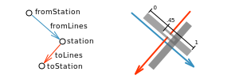

# vbb-change-positions

Crowd sourced database of station-specific platform positions for changes between [VBB](https://www.vbb.de) (Verkehrsverbund Berlin-Brandenburg) metro, suburban and regional lines.

You're invited to help, see the [data structure](#data-structure) and [contributing](#contributing) sections!

[](https://www.npmjs.com/package/vbb-change-positions)
[](https://travis-ci.org/juliuste/vbb-change-positions)
[](https://greenkeeper.io/)
[](https://david-dm.org/juliuste/vbb-change-positions)
[](https://david-dm.org/juliuste/vbb-change-positions#info=devDependencies)
[](license)
[](https://gitter.im/juliuste)

## Installation and Usage

If you're using `JavaScript`, you can use the module by installing:

```shell
npm install vbb-change-positions
```

If you call the function exported by the module, it will return a stream which emits objects that look like this:

```js
{
    fromStation: {
        id: "900000045102",
        name: "Heidelberger Platz"
    },
    fromLines: ["S42","S46"],
    previousStation: {
        id: "900000044101",
        name: "Hohenzollerndamm"
    },
    fromPosition: 1,
    toStation: {
        id: "900000045102",
        name: "Heidelberger Platz"
    },
    toLines: ["U3"],
    nextStation: {
        id: "900000045101",
        name: "Rüdesheimer Platz"
    },
    toPosition: 1,
    samePlatform: false
}
```

## Data structure

The dataset is located in `data.ndjson`, a [ndjson](http://ndjson.org/) file which you can edit using a text editor or [vbb-change-positions-cli](https://github.com/juliuste/vbb-change-positions-cli).

Let's take the following example: I want to take the `S46` in the direction of `Königs Wusterhausen` to `Heidelberger Platz`, where I want to change to the `U3` towards `Krumme Lanke`.



The dataset row would then contain the following information:

| key name | description | required | example |
| -------- | ----------- | -------- | ------- |
| `fromStation` | Station at which you arrive. Object containing the keys below. | yes | `{id: "900000045102", name: "Heidelberger Platz"}` |
| `fromStation.id` | Arrival station ID\* | yes | `900000045102` |
| `fromStation.name` | Arrival station name (only for readability of the dataset) | no | `Heidelberger Platz` |
| `fromLines`    | "Arriving" line names. Note that the lines must run on the same platform and share the same `fromStation`. For the lines that fit those criteria, there should exist only one dataset row grouping them, though. This key exists mostly because information on `fromTrack` is much harder to get/remember than the rather simple line names and sometimes the track changes but the platform doesn't. | yes | `["S42", "S46"]` |
| `previousStation` | Previous station on the line before changing. Object containing the keys below. | yes | `{id: "900000044101", name: "Hohenzollerndamm"}` |
| `previousStation.id` | Previous station ID\* | yes | `900000044101` |
| `previousStation.name` | Previous station name (only for readability of the dataset) | no | `Hohenzollerndamm` |
| `fromTrack`| Arrival platform (track)\*\* | no | *empty*
| `fromPosition`| Number where to leave the arrival platform. Between `0` (at the rear end of the station) and `1` (at the front "driver's" end of the station) \*\*\* | yes | `1` |
| `toStation` | Station at which you depart. Mostly the same as `fromStation`, but different for interchanges like `Kaiserdamm <-> Messe Nord/ICC` that are marked as one node on the public transport map. Object containing the keys below. | yes | `{id: "900000045102", name: "Heidelberger Platz"}` |
| `toStation.id` | Arrival station ID\* | yes | `900000045102` |
| `toStation.name` | Arrival station name (only for readability of the dataset) | no | `Heidelberger Platz` |
| `toLines`    | "Departing" line names, see `fromLines` | yes | `["U3"]` |
| `nextStation` | Next station on the line after changing. Object containing the keys below. | yes | `{id: "900000045101", name: "Rüdesheimer Platz"}` |
| `nextStation.id` | Next station ID\* | yes | `900000045101` |
| `nextStation.name` | Next station name (only for readability of the dataset) | no | `Rüdesheimer Platz` |
| `toTrack`| Departure platform (track)\*\* | no | *empty*
| `toPosition`| Number where to enter the departure platform.\*\*\* See also `fromPosition`. | yes | `1` |
| `samePlatform` | Set to `true` if both trains stop at the same platform (entire platform, not "only" track). `fromPosition` and `toPosition` will be ignored and **should be set to `0.5`** | no | `false` |

\* See [this document](station-ids.md) if you don't know how to find out some station's VBB station ID

\*\* If unknown, just leave empty/unset like I did here.

\*\*\* see [additional guidelines](#additional-guidelines)

Finally, our example would give us the following data row for the NDJSON file:

```json
{"fromStation":{"id":"900000045102","name":"Heidelberger Platz"},"fromLines":["S42","S46"],"previousStation":{"id":"900000044101","name":"Hohenzollerndamm"},"fromPosition":1,"toStation":{"id":"900000045102","name":"Heidelberger Platz"},"toLines":["U3"],"nextStation":{"id":"900000045101","name":"Rüdesheimer Platz"},"toPosition":1,"samePlatform":false}
```
### Additional guidelines

#### Parallel lines

There's a common situation where multiple lines run in parallel for a few stations in a row, like `S41/S42` and `S46` between `Westend` and `Neukölln` or `S1` and `S2` between `Yorckstraße` and `Bornholmer Straße`. A general rule of thumb for this case is that only if it's your last chance to change between two lines at a station, this specific interchange scenario should be mapped. However, if it's a common things for commuters to change at another station than the "last possible", then and only then that station should be added as well. To give you a few examples:

- `Neukölln` should be mapped for `S42@Hermannstraße -> S45/S46/S47@Köllnische Heide`, `S45/S46@Hermannstraße -> S42@Sonnenallee` and `S41/S42@Sonnenallee <-> S45/S46/S47@Köllnische Heide`, making 4 interchange scenarios. (For simplicity, I ignored the `U7` in this example, that should be mapped as well, of course).
- `Westend` should be mapped for `S46@Messe Nord/ICC -> S41@Jungernheide`, because the S46 terminates here, making it the last possible point of interchange. No other interchanges should be mapped for this station, though.
- `Plänterwald` should not be mapped at all, because it's not your *last chance* to change between any of the lines running there.
- `Priesterweg` should be mapped for 4 scenarios: `S2@Südkreuz -> S25/S26@Südende`, `S25/S26@Südkreuz -> S2@Attilastraße` and `S2@Attilastraße <-> S25/S26@Südende`
- `Heidelberger Platz` should be mapped for interchanges `S41/S42/S46 <-> U3`, but not for interchanges like `S41 -> S46` or even `S41 -> S42`
- `Flughafen Berlin-Schönefeld` Even though technically the last station to "change" between `S9` and `S45`, no interchanges should be mapped since **both** lines terminate here. For places where only one line terminates while the others continue, see the `Westend` example.
- `Jannowitzbrücke` Even though technically not the last chance to change between S-Bahn and `U8`, the interchange `S3/S5/S7/S9@Alexanderplatz <-> U8@Alexanderplatz` should be mapped, since a lot of people prefer to change at Jannowitzbrücke instead of Alexanderplatz because the ways are shorter and it's less crowded.
- `Wannsee` Same with this station. Even though one might assume people would change between `S1` and `S7` at Nikolassee, it's actually much more common to change at Wannsee, because trains stop at the same platform there. So `S7@Griebnitzsee -> S1@Nikolassee` should be added here.

#### Other

- If you're not too sure about the exact position on the platform, just take one of `0`, `0.5` or `1` that fits best, in order to prevent us from having data that seems really accurate but actually isn't.
- `fromStation` and `toStation` will mostly be the same, except for connections like `Messe Nord/ICC` and `Kaiserdamm`.
- If there are multiple ways connecting to platforms, either add separate rows for all of them or just add the shortest connection.
- `fromLines` and `toLines` must be different, `previousStation` and `nextStation` can be identical, however.

## Contributing

Please note that this dataset **only contains data for metro, suburban and regional lines**; buses and trams are not included.

Have a look at [this list](todo.md) for an overview of stations that are not yet covered.

If you want to add information to the dataset, **[fork this repository](https://help.github.com/articles/fork-a-repo/), add information and finally [submit a pull request](https://help.github.com/articles/about-pull-requests/)**. If you don't know how any of this works, you can also just [open an issue](https://github.com/juliuste/vbb-change-positions/issues) with the information you want to add in text form and I'll add it to the dataset for you. The same applies if you have found an error or want to change anything about the data structure.

Please note that by contributing to this project, you waive any copyright claims on the information you add.

## License

This dataset is licensed under the [`ODbL` license (v1.0)](https://opendatacommons.org/licenses/odbl/1.0/).
